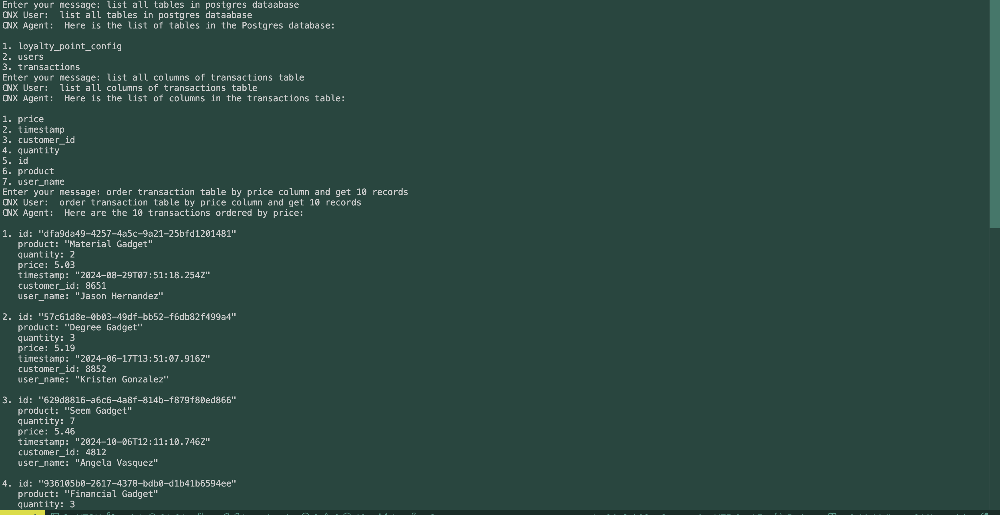
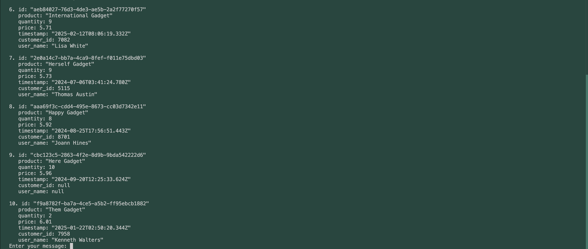
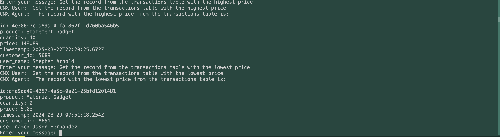

# MCP Database - Local Deployment Guide
  
This guide will help you self-host an MCP database, an LLM model, and a client — all on your local machine.

---

## 🚀 Requirements

- **NVIDIA GPU** with **≥ 6GB VRAM** (depending on your LLM model).
  - *Example:* Llama 3.2-3B successfully runs with only **4GB VRAM**.
- **Docker** and **Docker Compose** installed.
- **Conda** (for Python environment management).

---

## 📦 How to Run

### 1. Self-Host the LLM (Local Language Model)

It is recommended to use [GPUStack](https://github.com/gpustack/gpustack) for deploying LLMs easily on your local machine.

> Example: Running **Llama 3.2-3B** with 4GB VRAM.

---

### 2. Self-Host the MCP Server

We use [dbhub](https://github.com/bytebase/dbhub) as the backend MCP server.

#### Steps:
1. Update your database configuration in the `.env` file.
2. Start the MCP server using Docker Compose:

```bash
docker compose up -d
```

For more specialized MCP server repositories, check out:  
👉 [Awesome MCP Servers](https://github.com/punkpeye/awesome-mcp-servers)

---

### 3. Setup the MCP Client

After your MCP server is running:

1. Update the MCP server URL in the `.env` file.
   - Example MCP server URL (SSE mode):
     ```
     http://0.0.0.0:8080/sse
     ```

2. Setup a Python environment and install dependencies:

```bash
conda create -n <environment_name> python=3.10
conda activate <environment_name>
pip install -r requirements.txt
```

3. Run the MCP client:

```bash
python mcp_test.py
```

- Enter your prompt when asked, and see the results!

---


#### 🖼 MCP Client Demo:





---

### 4. (Optional) Generate Fake Data

You can generate a fake transactions database for testing:

```bash
python fake_data.py
```

---

## 📚 Notes

- Ensure Docker Engine and Conda are installed and properly configured.
- Adjust your `.env` carefully according to your database settings and server ports.
- GPU VRAM requirements will vary based on the LLM model size you select.

---

## 🔗 Useful Resources

- [GPUStack - Run LLMs Locally](https://github.com/gpustack/gpustack)
- [dbhub - Database Collaboration](https://github.com/bytebase/dbhub)
- [Awesome MCP Servers](https://github.com/punkpeye/awesome-mcp-servers)

---
## ✨ Future Improvements (Optional)

- [ ] Add a system architecture diagram
- [ ] Self-implement a custom MCP server
